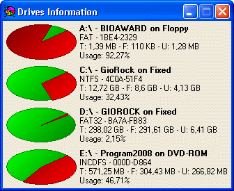



## Cake Drives Information

### Description

Show all drives information by Cake blending color graphical mode.

Display Path, Volume, Serial Number, Type, FileSystem, Total - Free - Used spaces and percentage of usage for all attached device.
 
### More Info
 

             |
---                |---
**Submitted On**   |2008-11-29 18:26:48
**By**             |[GioRock](https://github.com/Planet-Source-Code/PSCIndex/blob/master/ByAuthor/giorock.md)
**Level**          |Advanced
**User Rating**    |5.0 (15 globes from 3 users)
**Compatibility**  |VB 6\.0
**Category**       |[Miscellaneous](https://github.com/Planet-Source-Code/PSCIndex/blob/master/ByCategory/miscellaneous__1-1.md)
**World**          |[Visual Basic](https://github.com/Planet-Source-Code/PSCIndex/blob/master/ByWorld/visual-basic.md)
**Archive File**   |[Cake\_Drive2135871212008\.zip](https://github.com/Planet-Source-Code/giorock-cake-drives-information__1-71478/archive/master.zip)

